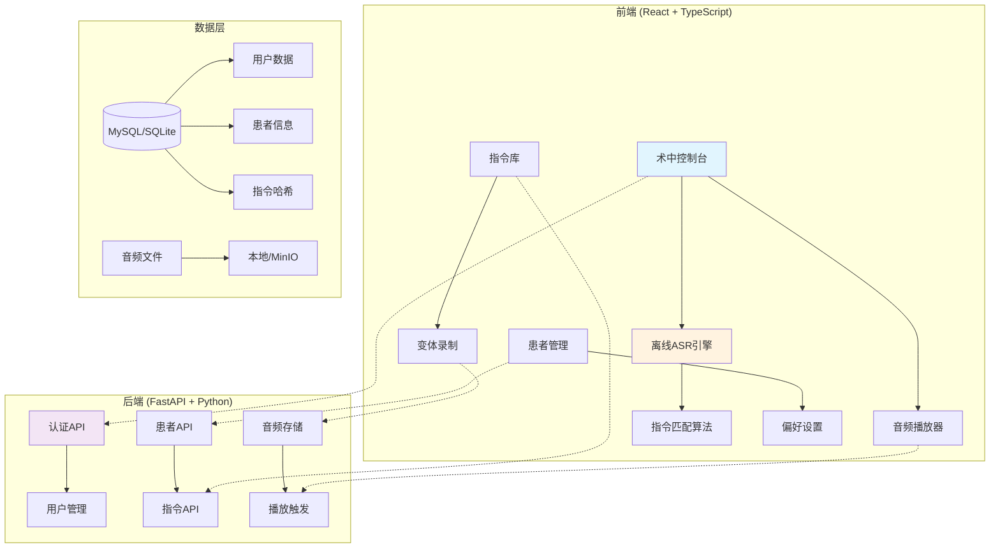
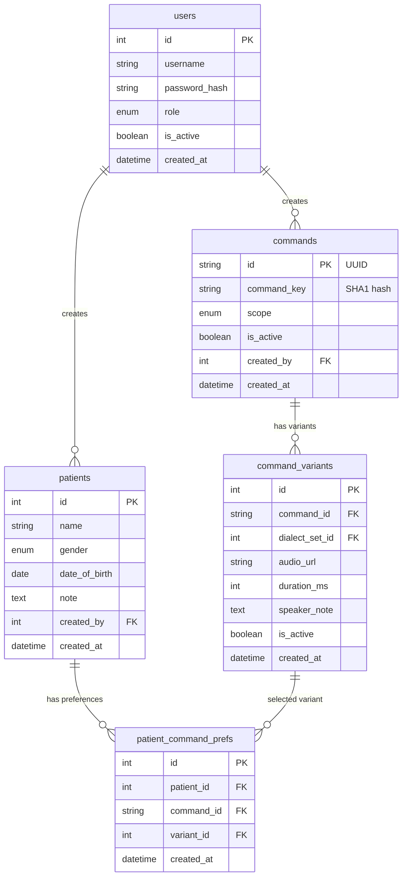

# VoiceMatch 术中语音指令播放系统

> 🏥 解决术中医患语言沟通问题的离线语音指令播放系统

VoiceMatch 是一个专为手术室设计的智能语音系统，通过预录制的方言音频和实时语音识别，帮助医生与不同语言背景的患者进行有效沟通。

## ✨ 核心特性

### 🎯 核心功能
- **离线语音识别**: 使用 WebWorker + whisper.cpp 在浏览器中离线运行
- **多方言支持**: 支持普通话、粤语、吴语、客家话等多种方言变体
- **个性化绑定**: 为每位患者定制专属的方言音频偏好
- **实时播放**: 唤醒词 + 指令触发，自动播放对应方言音频
- **隐私保护**: 语音识别完全在前端进行，不上传音频数据

### 🔧 技术特色
- **前后端分离**: FastAPI + React TypeScript 架构
- **权限控制**: 基于 JWT 的角色权限系统
- **存储灵活**: 支持本地文件系统和 MinIO 对象存储
- **数据安全**: 指令文本采用 SHA1 哈希存储，明文仅在前端保存
- **Docker 部署**: 一键部署，支持多环境配置

## 🏗️ 系统架构



## 📊 数据库设计

系统采用隐私优先的设计，指令明文仅存储在前端，后端仅保存 SHA1 哈希用于匹配：



## 🚀 快速开始

### 前置要求

- Docker Desktop (推荐)
- 或者本地环境:
  - Python 3.11+
  - Node.js 18+
  - MySQL 8.0+ (可选，默认使用 SQLite)

### 一键部署 (Docker)

```bash
# 1. 克隆项目
git clone <repository-url>
cd VoiceMatch

# 2. 复制环境配置
cp env.example .env
# 编辑 .env 文件，修改密钥等配置

# 3. 启动完整系统
make up
# 或者
docker-compose up -d

# 4. 初始化数据
make seed
```

系统启动后访问：
- 前端界面: http://localhost
- API 文档: http://localhost:8000/api/docs
- MinIO 控制台: http://localhost:9001

### 本地开发

```bash
# 1. 安装依赖
make install

# 2. 启动开发环境
make dev

# 3. 数据库迁移
make migrate

# 4. 初始化种子数据
make seed
```

### 默认账户

| 角色 | 用户名 | 密码 | 权限 |
|------|--------|------|------|
| 管理员 | admin | admin123 | 全局指令管理、用户管理、系统设置 |
| 医生 | doctor | doctor123 | 患者管理、个人指令库、术中操作 |

## 📖 使用指南

### 1. 术前准备

#### 创建患者档案
1. 登录系统后进入"患者管理"
2. 添加患者基本信息（姓名、性别、出生日期）
3. 备注中记录患者的语言背景

#### 录制指令变体
1. 进入"指令库"管理
2. 创建新指令（系统会生成 command_key）
3. 为指令录制不同方言的音频变体
4. 支持的格式：WAV, MP3, Opus, M4A

#### 设置患者偏好
1. 在患者详情页面
2. 选择"偏好设置"标签
3. 为每个指令选择患者能理解的方言变体

### 2. 术中使用

#### 启动监听
1. 进入"术中控制台"
2. 选择当前患者
3. 选择麦克风设备
4. 点击"开始监听"

#### 语音指令流程
1. 说出唤醒词："医生助手" 或 "小医"
2. 在3秒窗口期内说出指令内容
3. 系统自动匹配并播放对应的方言音频
4. 支持手动重播和手动触发

### 3. 系统管理

#### 方言管理
- 支持添加新的方言类型
- 设置默认方言
- 方言代码规范：zh-cn, zh-yue, wu, hak 等

#### 用户权限
- **管理员**: 完整系统权限
- **医生**: 患者和个人指令管理权限

## 🔧 配置说明

### 环境变量

| 变量名 | 描述 | 默认值 |
|--------|------|--------|
| `DATABASE_URL` | 数据库连接字符串 | `sqlite:///./voicematch.db` |
| `STORAGE_BACKEND` | 存储后端 | `local` |
| `JWT_SECRET_KEY` | JWT 密钥 | **必须修改** |
| `MINIO_ENDPOINT` | MinIO 端点 | `localhost:9000` |
| `DEBUG` | 调试模式 | `false` |

### 音频配置

- **最大文件大小**: 50MB
- **最大时长**: 5分钟  
- **推荐格式**: WAV (16kHz, mono)
- **支持格式**: WAV, MP3, Opus, M4A

### 语音识别配置

- **唤醒词**: ["医生助手", "小医"]
- **窗口期**: 3秒
- **匹配阈值**: 85%
- **冷却时间**: 3秒

## 🧪 测试

```bash
# 运行所有测试
make test

# 后端测试
cd backend && python -m pytest tests/ -v

# 前端测试  
cd frontend && npm run test

# E2E 测试
cd frontend && npm run test:e2e
```

## 📦 部署指南

### 生产环境部署

1. **准备服务器**
   ```bash
   # 安装 Docker 和 Docker Compose
   curl -fsSL https://get.docker.com | sh
   sudo usermod -aG docker $USER
   ```

2. **配置环境**
   ```bash
   # 复制并修改配置
   cp env.example .env
   
   # 生成安全密钥
   openssl rand -hex 32  # 用于 JWT_SECRET_KEY
   openssl rand -hex 32  # 用于 SECRET_KEY
   ```

3. **启动服务**
   ```bash
   # 生产环境启动
   docker-compose -f docker-compose.yml up -d
   
   # 检查服务状态
   docker-compose ps
   
   # 查看日志
   docker-compose logs -f
   ```

4. **SSL 配置** (可选)
   ```bash
   # 使用 Let's Encrypt
   certbot --nginx -d yourdomain.com
   ```

### 数据备份

```bash
# 备份数据库
make backup

# 恢复数据库
make restore FILE=backup_20231201_120000.sql

# 备份音频文件
tar -czf audio_backup.tar.gz data/audio/
```

## 🔒 安全考虑

### 隐私保护
- ✅ 语音识别完全离线，不上传音频
- ✅ 指令文本仅存储在前端 IndexedDB
- ✅ 后端仅保存 SHA1 哈希值
- ✅ 患者敏感信息最小化收集

### 安全措施  
- ✅ JWT 认证 + 角色权限控制
- ✅ bcrypt 密码加密
- ✅ CORS 白名单限制
- ✅ 文件上传类型验证
- ✅ SQL 注入防护

### 合规建议
- 定期更新密钥和证书
- 配置数据保留期限
- 启用访问日志审计
- 定期安全扫描

## 🛠️ 开发指南

### 项目结构

```
VoiceMatch/
├── backend/                 # FastAPI 后端
│   ├── app/
│   │   ├── api/            # API 路由
│   │   ├── core/           # 核心配置
│   │   ├── models/         # 数据模型
│   │   ├── schemas/        # Pydantic 模式
│   │   ├── services/       # 业务逻辑
│   │   └── migrations/     # 数据库迁移
│   ├── scripts/            # 工具脚本
│   └── tests/              # 测试文件
├── frontend/               # React 前端
│   ├── src/
│   │   ├── components/     # UI 组件
│   │   ├── pages/          # 页面组件
│   │   ├── api/            # API 客户端
│   │   ├── utils/          # 工具函数
│   │   └── types/          # TypeScript 类型
│   └── public/             # 静态资源
├── deploy/                 # 部署配置
└── docs/                   # 文档
```

### API 接口

#### 认证接口
- `POST /api/v1/auth/login` - 用户登录
- `POST /api/v1/auth/refresh` - 刷新令牌
- `GET /api/v1/auth/me` - 获取用户信息

#### 患者管理
- `GET /api/v1/patients` - 患者列表
- `POST /api/v1/patients` - 创建患者
- `PUT /api/v1/patients/{id}` - 更新患者
- `GET /api/v1/patients/{id}/prefs` - 患者偏好

#### 指令管理
- `GET /api/v1/commands` - 指令列表
- `POST /api/v1/commands` - 创建指令
- `POST /api/v1/commands/{id}/variants` - 添加变体

#### 播放控制
- `POST /api/v1/playback/trigger` - 手动触发播放
- `GET /api/v1/resolve/play` - 解析播放变体

### 前端架构

- **状态管理**: React Query + Context API
- **路由**: React Router v6
- **表单**: react-hook-form + Zod 验证
- **UI 组件**: shadcn/ui + Tailwind CSS
- **音频**: Howler.js / 原生 Audio API
- **语音识别**: WebWorker + whisper.cpp

### 代码规范

```bash
# 后端代码检查和格式化
make lint
make format

# 前端代码检查
cd frontend && npm run lint
```

## 🤝 贡献指南

1. Fork 项目
2. 创建特性分支 (`git checkout -b feature/amazing-feature`)
3. 提交更改 (`git commit -m 'Add amazing feature'`)
4. 推送分支 (`git push origin feature/amazing-feature`)
5. 创建 Pull Request

## 📝 更新日志

### v1.0.0 (2023-12-01)
- ✨ 首次发布
- 🎯 完整的术中语音指令播放功能
- 🔐 用户认证和权限管理
- 📱 响应式 Web 界面
- 🐳 Docker 部署支持

## 📄 许可证

本项目采用 MIT 许可证 - 查看 [LICENSE](LICENSE) 文件了解详情。

## 🆘 故障排除

### 常见问题

**Q: 语音识别不工作？**
A: 检查浏览器麦克风权限，确保使用 HTTPS 或 localhost

**Q: 音频播放失败？**
A: 检查音频文件格式和路径，确保文件未损坏

**Q: Docker 启动失败？**
A: 检查端口占用，确保 3306, 8000, 80 端口可用

**Q: 数据库连接错误？**
A: 检查 .env 配置，确保数据库服务正常启动

### 性能调优

- **CPU 模式**: 单实例支持 1 路流
- **GPU 模式**: 单实例支持 3-5 路流  
- **内存需求**: 最少 4GB RAM
- **存储需求**: 根据音频文件数量调整

### 日志调试

```bash
# 查看实时日志
docker-compose logs -f

# 查看特定服务日志
docker-compose logs -f api
docker-compose logs -f web

# 进入容器调试
docker exec -it voicematch_api bash
```

## 📞 技术支持

如有问题或建议，请：

1. 查看 [FAQ](docs/FAQ.md)
2. 搜索 [Issues](../../issues)
3. 创建新 Issue 或 Discussion
4. 联系开发团队

---

🏥 **VoiceMatch** - 让医患沟通无障碍！
