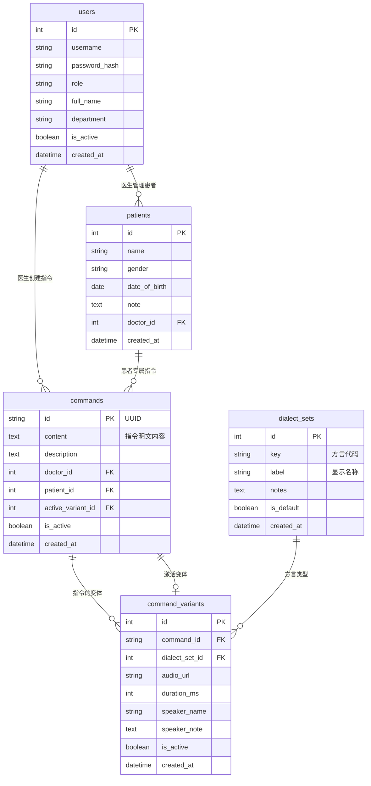

# VoiceMatch 后端API文档 (v2.0)

> 🏥 术中语音指令播放系统后端API接口文档 - 重新设计版本

## 📋 目录

- [接口概述](#接口概述)
- [数据模型变更](#数据模型变更)
- [认证接口](#认证接口)
- [患者管理](#患者管理)
- [指令管理](#指令管理)
- [指令变体管理](#指令变体管理)
- [文件上传](#文件上传)
- [音频播放控制](#音频播放控制)
- [系统管理](#系统管理)
- [错误代码](#错误代码)
- [数据模型](#数据模型)

---

## 🌐 接口概述

### 基础信息

- **基础URL**: `http://localhost:8001/api/v1`
- **认证方式**: Bearer Token (JWT)
- **内容类型**: `application/json`（除文件上传外）
- **字符编码**: UTF-8

### 重要变更说明 (v2.0)

✨ **新的数据架构**：
- 每个患者现在有自己的专属指令集合
- 指令内容以明文形式存储，便于管理和搜索
- 每个指令明确归属于特定医生和患者
- 简化的变体分配：每个指令直接关联一个激活变体

### 通用HTTP状态码

| 状态码 | 说明 |
|--------|------|
| 200 | 请求成功 |
| 201 | 创建成功 |
| 400 | 请求参数错误 |
| 401 | 未认证或令牌无效 |
| 403 | 权限不足 |
| 404 | 资源不存在 |
| 413 | 请求实体过大 |
| 422 | 参数验证失败 |
| 500 | 服务器内部错误 |

---

## 🔄 数据模型变更

### 新的数据关系



---

## 🔐 认证接口

认证接口保持不变，详见原文档。

---

## 👥 患者管理

### 获取患者列表

**GET** `/patients`

获取当前医生的患者列表。

#### 查询参数

| 参数 | 类型 | 必填 | 说明 |
|------|------|------|------|
| page | int | 否 | 页码，默认1 |
| size | int | 否 | 每页数量，默认20，最大100 |
| search | string | 否 | 搜索关键词（患者姓名） |

#### 响应

```json
{
  "items": [
    {
      "id": 1,
      "name": "张三",
      "gender": "M",
      "date_of_birth": "1980-05-15",
      "note": "说粤语的患者，需要温柔语调",
      "doctor_id": 2,
      "created_at": "2023-12-01T10:00:00Z",
      "updated_at": "2023-12-01T10:00:00Z"
    }
  ],
  "total": 50,
  "page": 1,
  "size": 20,
  "pages": 3
}
```

### 创建患者

**POST** `/patients`

为当前医生创建新患者。

#### 请求体

```json
{
  "name": "李四",
  "gender": "F",
  "date_of_birth": "1975-08-20",
  "note": "说普通话的患者"
}
```

### 获取患者详情（包含指令）

**GET** `/patients/{patient_id}`

获取患者详细信息，包含所有指令。

#### 响应

```json
{
  "id": 1,
  "name": "张三",
  "gender": "M",
  "date_of_birth": "1980-05-15",
  "note": "说粤语的患者",
  "doctor_id": 2,
  "created_at": "2023-12-01T10:00:00Z",
  "updated_at": "2023-12-01T10:00:00Z",
  "commands": [
    {
      "id": "cmd-uuid-123",
      "content": "请放松，不要紧张",
      "description": "术前安抚用语",
      "doctor_id": 2,
      "patient_id": 1,
      "active_variant_id": 5,
      "is_active": true,
      "created_at": "2023-12-01T10:00:00Z"
    }
  ],
  "total_commands": 3,
  "active_commands": 3
}
```

### 批量为患者创建指令

**POST** `/patients/{patient_id}/commands/batch`

批量为患者创建多个指令。

#### 请求体

```json
{
  "patient_id": 1,
  "commands": [
    {
      "command_content": "请放松，不要紧张",
      "description": "术前安抚用语",
      "variant_id": 5
    },
    {
      "command_content": "深呼吸，慢慢来",
      "description": "呼吸指导",
      "variant_id": 6
    }
  ]
}
```

### 获取患者的所有指令

**GET** `/patients/{patient_id}/commands`

获取指定患者的所有指令列表。

#### 响应

```json
[
  {
    "id": "cmd-uuid-123",
    "content": "请放松，不要紧张",
    "description": "术前安抚用语",
    "doctor_id": 2,
    "patient_id": 1,
    "active_variant_id": 5,
    "is_active": true,
    "created_at": "2023-12-01T10:00:00Z",
    "updated_at": "2023-12-01T10:00:00Z"
  }
]
```

---

## 📋 指令管理

### 获取指令列表

**GET** `/commands`

获取指令列表，支持按患者过滤。

#### 查询参数

| 参数 | 类型 | 必填 | 说明 |
|------|------|------|------|
| page | int | 否 | 页码，默认1 |
| size | int | 否 | 每页数量，默认20 |
| patient_id | int | 否 | 患者ID过滤 |
| is_active | bool | 否 | 是否激活 |
| search | string | 否 | 搜索关键词（指令内容） |

#### 响应

```json
{
  "items": [
    {
      "id": "cmd-uuid-123",
      "content": "请放松，不要紧张",
      "description": "术前安抚用语",
      "doctor_id": 2,
      "patient_id": 1,
      "active_variant_id": 5,
      "is_active": true,
      "created_at": "2023-12-01T10:00:00Z",
      "updated_at": "2023-12-01T10:00:00Z"
    }
  ],
  "total": 10,
  "page": 1,
  "size": 20,
  "pages": 1
}
```

### 创建指令

**POST** `/commands`

为指定患者创建新指令。

#### 请求体

```json
{
  "content": "请配合医生的操作",
  "description": "手术配合指导",
  "patient_id": 1,
  "active_variant_id": 8
}
```

### 获取指令详情（包含变体）

**GET** `/commands/{command_id}`

获取指令详细信息，包含所有可用变体。

#### 响应

```json
{
  "id": "cmd-uuid-123",
  "content": "请放松，不要紧张",
  "description": "术前安抚用语",
  "doctor_id": 2,
  "patient_id": 1,
  "active_variant_id": 5,
  "is_active": true,
  "created_at": "2023-12-01T10:00:00Z",
  "updated_at": "2023-12-01T10:00:00Z",
  "active_variant": {
    "id": 5,
    "audio_url": "/media/2/audio5.wav",
    "duration_ms": 3200,
    "speaker_name": "张护士",
    "speaker_note": "粤语女声，温柔语调"
  },
  "all_variants": [
    {
      "id": 5,
      "audio_url": "/media/2/audio5.wav",
      "duration_ms": 3200,
      "speaker_name": "张护士",
      "speaker_note": "粤语女声，温柔语调"
    }
  ]
}
```

### 更新指令

**PUT** `/commands/{command_id}`

更新指令信息。

#### 请求体

```json
{
  "content": "请深呼吸，放松身体",
  "description": "更新后的指令描述",
  "active_variant_id": 9
}
```

### 获取医生指令统计

**GET** `/commands/stats/doctor`

获取当前医生的指令统计信息。

#### 响应

```json
{
  "doctor_id": 2,
  "doctor_name": "张医生",
  "total_patients": 5,
  "total_commands": 15,
  "total_variants": 23,
  "patients": [
    {
      "patient_id": 1,
      "patient_name": "张三",
      "patient_gender": "M",
      "total_commands": 3,
      "active_commands": 3,
      "commands_with_audio": 3
    }
  ]
}
```

---

## 🎵 指令变体管理

### 获取方言集列表

**GET** `/dialect-sets`

获取所有可用的方言集。

#### 响应

```json
[
  {
    "id": 1,
    "key": "zh-cn",
    "label": "普通话",
    "notes": "标准普通话",
    "is_default": true,
    "created_at": "2023-12-01T10:00:00Z"
  },
  {
    "id": 2,
    "key": "zh-yue",
    "label": "粤语",
    "notes": "广东话/港式粤语",
    "is_default": false,
    "created_at": "2023-12-01T10:00:00Z"
  }
]
```

### 获取指令的所有变体

**GET** `/commands/{command_id}/variants`

获取指定指令的所有音频变体。

#### 响应

```json
[
  {
    "id": 5,
    "command_id": "cmd-uuid-123",
    "dialect_set_id": 2,
    "audio_url": "/media/2/audio5.wav",
    "duration_ms": 3200,
    "speaker_name": "张护士",
    "speaker_note": "粤语女声，温柔语调",
    "is_active": true,
    "created_by": 2,
    "created_at": "2023-12-01T10:00:00Z",
    "updated_at": "2023-12-01T10:00:00Z",
    "dialect_set": {
      "id": 2,
      "key": "zh-yue",
      "label": "粤语",
      "notes": "广东话/港式粤语",
      "is_default": false
    }
  }
]
```

### 创建指令变体

**POST** `/commands/{command_id}/variants`

为指定指令创建新的方言变体。

#### 请求体

```json
{
  "dialect_set_id": 1,
  "audio_url": "/media/3/audio_new.wav",
  "duration_ms": 3000,
  "speaker_name": "李护士",
  "speaker_note": "普通话女声，亲切语调"
}
```

### 更新指令变体

**PUT** `/variants/{variant_id}`

更新指令变体信息。

#### 请求体

```json
{
  "speaker_name": "王护士",
  "speaker_note": "更新后的说话人备注",
  "duration_ms": 3500
}
```

### 设置指令的激活变体

**POST** `/variants/{variant_id}/set-active/{command_id}`

将指定变体设置为指令的激活变体。

#### 响应

```json
{
  "message": "已将变体 5 设置为指令 cmd-uuid-123 的激活变体"
}
```

### 删除指令变体

**DELETE** `/variants/{variant_id}`

删除指令变体（软删除）。

---

## 📤 文件上传

文件上传接口保持不变，详见原文档。

---

## 🔊 音频播放控制

### 手动触发播放

**POST** `/playback/trigger`

手动触发指定患者和指令的音频播放。

#### 请求体

```json
{
  "patient_id": 1,
  "command_id": "cmd-uuid-123"
}
```

#### 响应

```json
{
  "audio_url": "/media/2/audio5.wav",
  "command_id": "cmd-uuid-123",
  "command_content": "请放松，不要紧张",
  "variant_id": 5,
  "dialect_label": "粤语",
  "duration_ms": 3200
}
```

### 根据内容触发播放

**POST** `/playback/trigger-by-content`

根据指令内容匹配并触发播放（用于语音识别）。

#### 请求体

```json
{
  "patient_id": 1,
  "command_content": "放松"
}
```

#### 响应

```json
{
  "audio_url": "/media/2/audio5.wav",
  "command_id": "cmd-uuid-123",
  "command_content": "请放松，不要紧张",
  "variant_id": 5,
  "dialect_label": "粤语",
  "duration_ms": 3200
}
```

### 获取患者的所有可播放指令

**GET** `/playback/resolve/{patient_id}`

获取患者的所有可播放指令列表（用于前端预加载）。

#### 响应

```json
{
  "patient_id": 1,
  "patient_name": "张三",
  "total_commands": 3,
  "commands": [
    {
      "command_id": "cmd-uuid-123",
      "content": "请放松，不要紧张",
      "description": "术前安抚用语",
      "audio_url": "/media/2/audio5.wav",
      "duration_ms": 3200,
      "dialect_label": "粤语",
      "variant_id": 5
    }
  ]
}
```

### 记录播放事件

**POST** `/playback/log`

记录播放事件到审计日志。

#### 请求体

```json
{
  "patient_id": 1,
  "command_content": "请放松，不要紧张"
}
```

---

## ⚙️ 系统管理

系统管理接口保持不变，详见原文档。

---

## 📊 数据模型

### 用户角色枚举

```typescript
enum UserRole {
  ADMIN = "admin",
  DOCTOR = "doctor"
}
```

### 性别枚举

```typescript
enum Gender {
  MALE = "M",
  FEMALE = "F", 
  OTHER = "Other"
}
```

### 指令响应模型

```typescript
interface CommandResponse {
  id: string;              // UUID
  content: string;         // 指令明文内容
  description?: string;    // 指令描述
  doctor_id: number;       // 创建医生ID
  patient_id: number;      // 归属患者ID
  active_variant_id?: number; // 激活变体ID
  is_active: boolean;      // 是否激活
  created_at: string;      // 创建时间
  updated_at: string;      // 更新时间
}
```

### 变体响应模型

```typescript
interface CommandVariantResponse {
  id: number;
  command_id: string;
  dialect_set_id: number;
  audio_url: string;
  duration_ms?: number;
  speaker_name?: string;   // 新增：说话人姓名
  speaker_note?: string;   // 说话人备注
  is_active: boolean;
  created_by?: number;
  created_at: string;
  updated_at: string;
}
```

---

## 🔧 新版本特性

### 核心改进

1. **清晰的数据归属**：每个指令明确归属于特定医生和患者
2. **明文内容存储**：指令内容直接存储，便于搜索和管理
3. **简化的变体管理**：每个指令直接关联激活变体
4. **增强的权限控制**：医生只能管理自己的患者和指令

### API增强

1. **批量操作**：支持批量创建患者指令
2. **内容搜索**：支持按指令内容搜索
3. **统计信息**：提供医生指令统计
4. **变体管理**：支持设置激活变体

### 数据完整性

1. **外键约束**：严格的数据关联约束
2. **权限验证**：所有操作都有权限检查
3. **软删除**：重要数据采用软删除机制

---

## 📝 使用示例

### 完整工作流程

1. **医生登录**
   ```bash
   POST /auth/login
   # 获取JWT token
   ```

2. **创建患者**
   ```bash
   POST /patients
   # 创建新患者档案
   ```

3. **为患者创建指令**
   ```bash
   POST /commands
   # 创建指令："请放松，不要紧张"
   ```

4. **上传音频并创建变体**
   ```bash
   POST /uploads/audio
   # 上传粤语音频文件
   
   POST /commands/{command_id}/variants
   # 创建粤语变体
   ```

5. **设置激活变体**
   ```bash
   POST /variants/{variant_id}/set-active/{command_id}
   # 设置粤语变体为激活变体
   ```

6. **术中播放**
   ```bash
   POST /playback/trigger-by-content
   # 语音识别匹配后自动播放
   ```

---

## 🆘 迁移指南

从v1.0升级到v2.0的主要变更：

1. **数据结构变更**：
   - 删除 `patient_command_pref` 表
   - `commands` 表新增 `content`、`patient_id` 字段
   - `command_variants` 表新增 `speaker_name` 字段

2. **API变更**：
   - 指令创建现在需要指定 `patient_id`
   - 播放接口支持内容匹配
   - 新增批量创建指令接口

3. **权限变更**：
   - 更严格的权限控制
   - 医生只能管理自己的数据

---

🏥 **VoiceMatch API v2.0** - 更清晰的数据结构，更强大的功能！